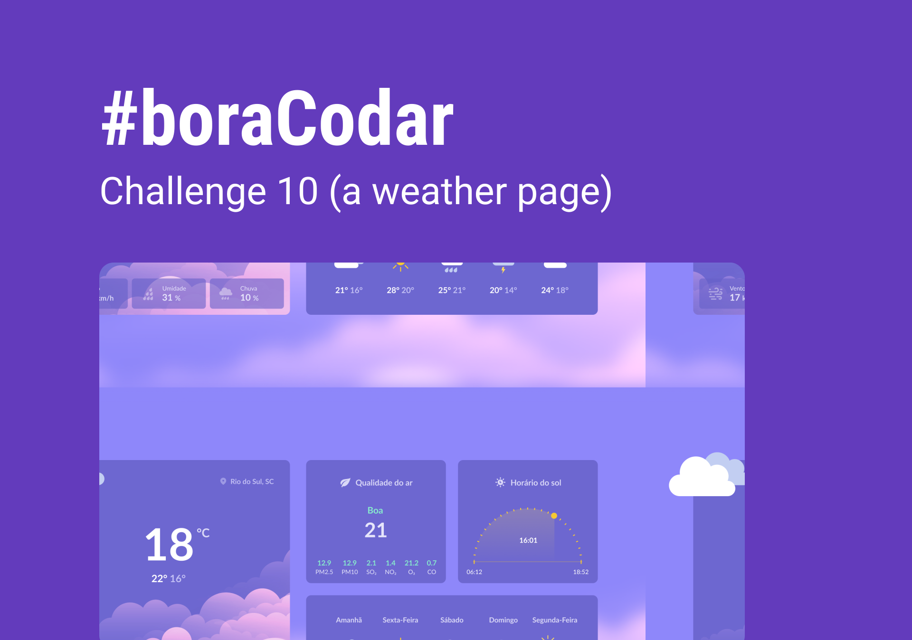

<h1 align="center"> Wheather </h1>

 A Weather page 

<a href="https://comforting-sunshine-327be7.netlify.app/">
  Click here or on the image above to access the project page
</a>

---

## Technologies

Project developed with the following technologies:

- React Js
- Typescript
- Chackra UI
- Git and Github

## Project

Weekly challenge [#boracodar](https://boracodar.dev/) proposed by [rocketseat](https://www.rocketseat.com.br/)

#9 - A Weather page

## Layout

You can view the project layout through [THIS LINK](https://www.figma.com/community/file/1215291914714743267).

---

Created by [Jairo Sousa](https://github.com/jairo-sousa)
